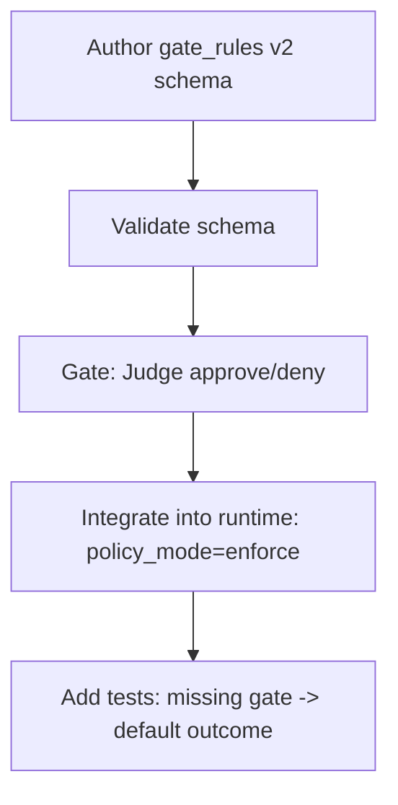

# Episode: Kernel Gate Rules v1 → v2

- **created_at:** 2026-02-13T02:35:17Z
- **goal:** Upgrade gate rules to an enforceable, replayable contract tied to ledger evidence.

```mermaid
flowchart TD
  A[Author gate_rules v2 schema] --> B[Validate schema]
  B --> C[Gate: Judge approve/deny]
  C --> D[Integrate into runtime: policy_mode=enforce]
  D --> E[Add tests: missing gate -> default outcome]
```
