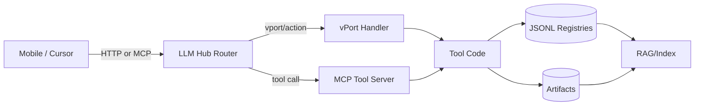

# Architecture (v1)

## Goal
A schema-locked tool repository where every tool is discoverable and callable via:
- MCP tool servers
- vPort handlers in AoS pipelines
- optional HTTP endpoints (mobile-first)

## Registries
- tools_catalog.jsonl: tool discovery + capabilities
- vport_registry.jsonl: vPort name → handler entrypoint mapping
- knowledge_ingestion_index.jsonl: what Cursor/RAG ingests

## Execution Styles
1) **MCP Tool Server** (preferred for shared hub execution)
2) **vPort Handler** (preferred inside AoS router/pipelines)
3) **HTTP Microservice** (mobile callable, simplest integration)

